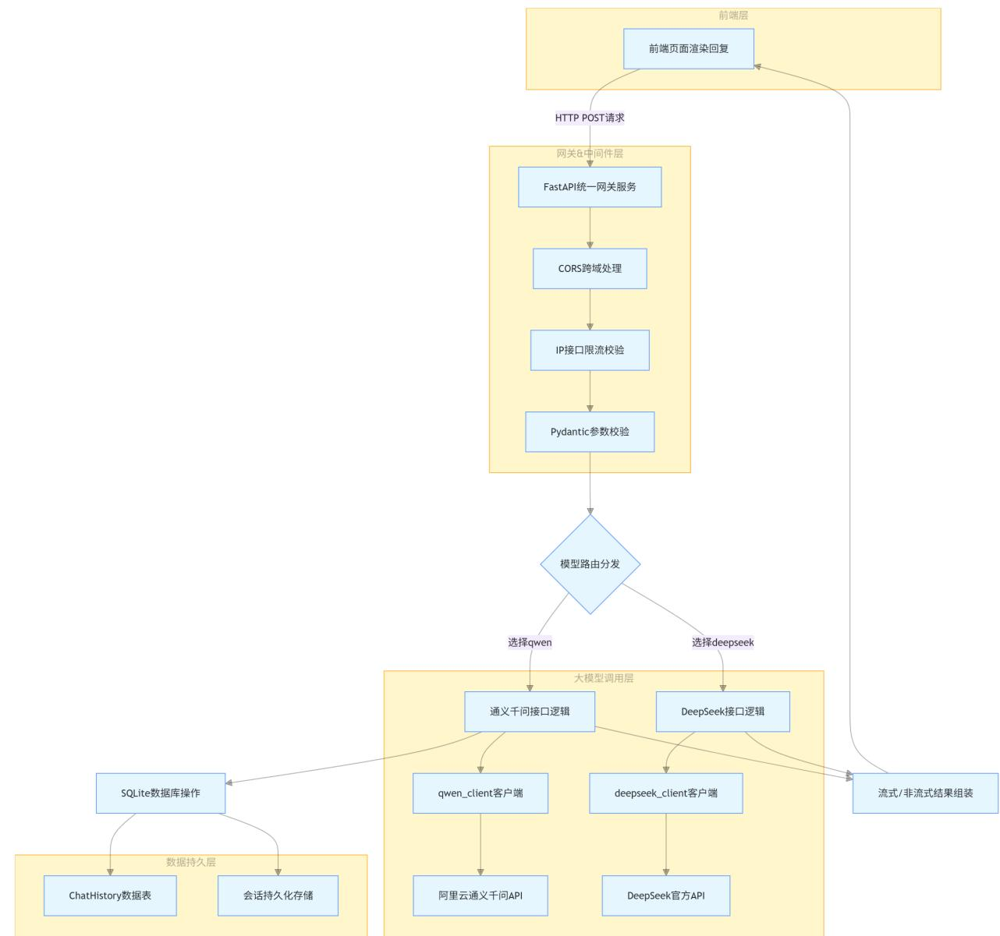
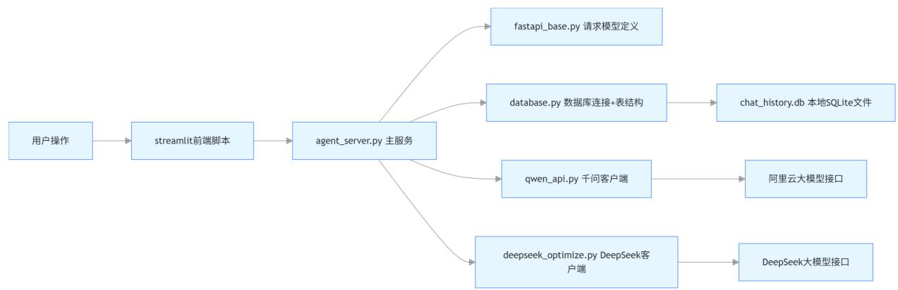
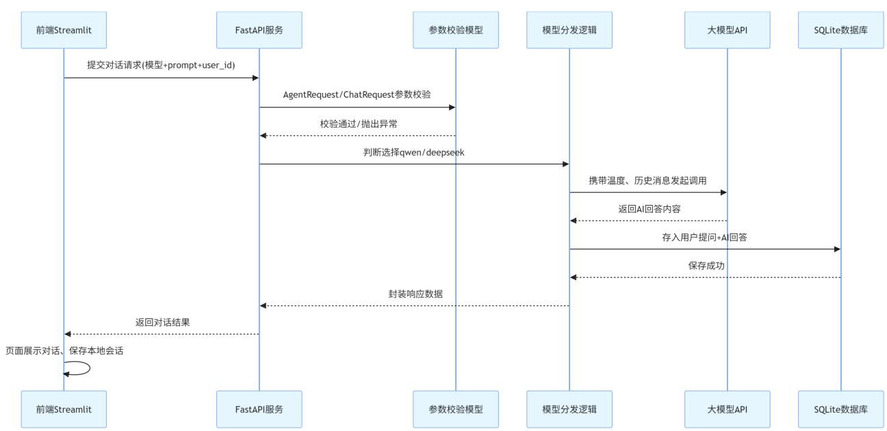
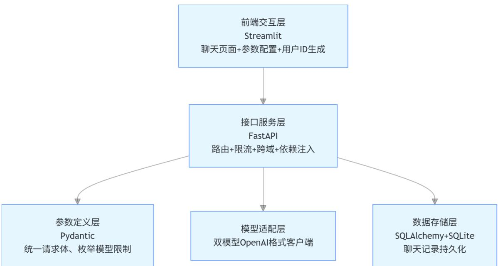
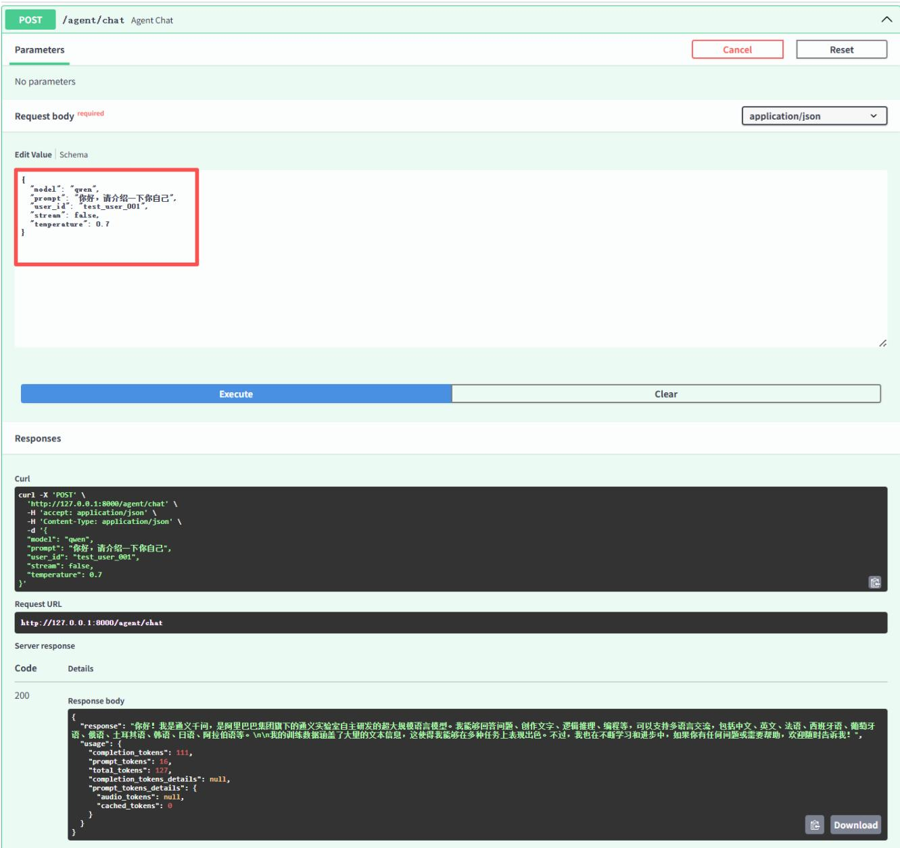
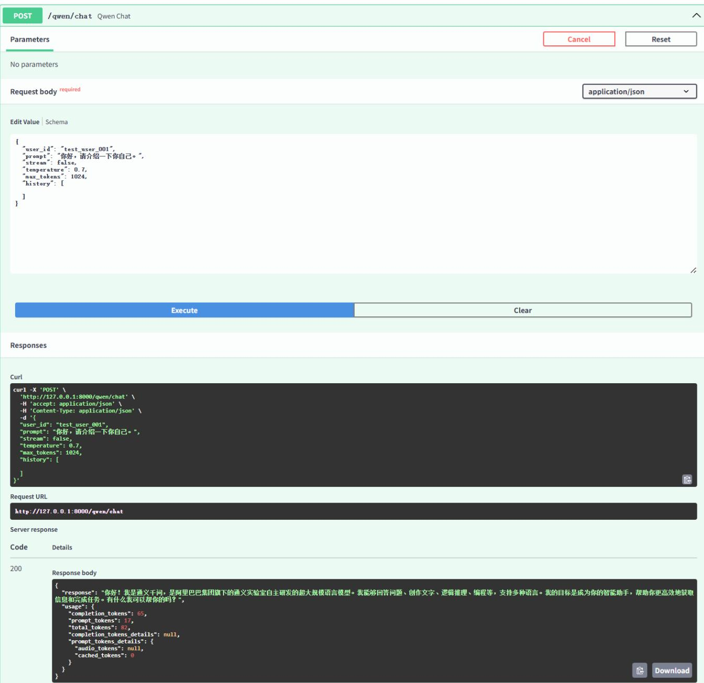
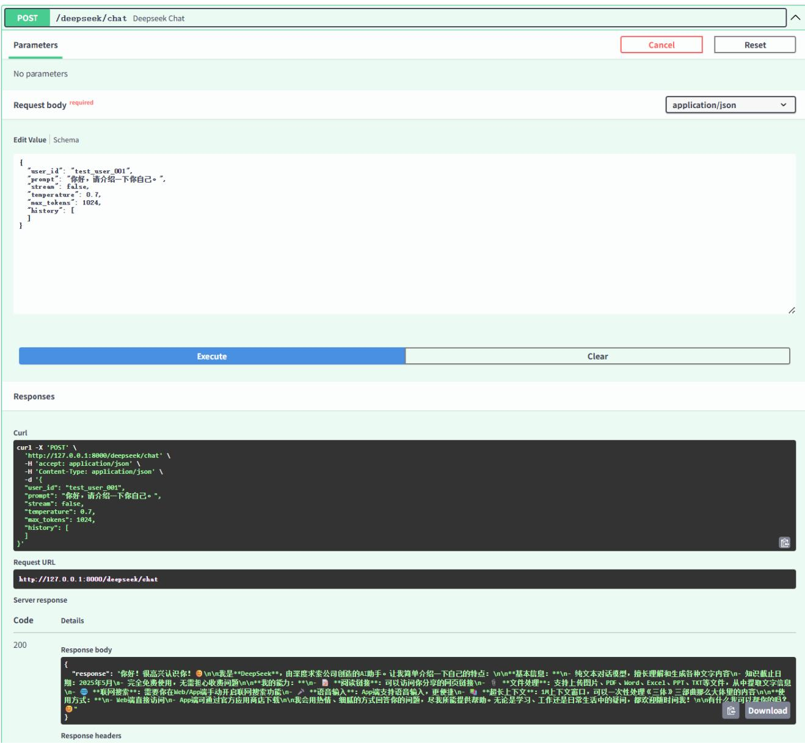

## 代码文件分层架构图



## 单次请求执行时序图



## 核心模块职责简图



## 整体流程

1. 前端 Streamlit 发请求 → /agent/chat

2. FastAPI 统一接口 根据 model 路由到 qwen 或 deepseek

3. 对应模型 调用 API 生成回答

4. 通义千问/DeepSeek 会把对话存到 SQLite 数据库

5. 返回回答 给前端显示

6. 前端 展示聊天记录

## 1. fastapi\_base.py

```python
# 导入 Pydantic 的 BaseModel，用于定义**请求数据格式**（校验+自动文档）
from pydantic import BaseModel

# 导入类型注解工具：
# Optional = 可选（可以不传）
# List = 列表
# Literal = 固定枚举值（只能选指定的内容）
from typing import Optional, List, Literal

# ---- 请求模型 ----
# 定义【通用聊天请求】的参数格式
class ChatRequest(BaseModel):
    user_id: str    # 字符串：用户唯一ID（必须传）
    prompt: str    # 字符串：用户输入的问题（必须传）
    stream: bool = False    # 布尔：是否流式输出，默认关闭
    temperature: float = 0.7    # 浮点数：生成温度（0=严谨，1=发散）
    max_tokens: int = 1024    # 整数：最大生成字数，默认1024
```

```python
history: Optional[List[dict]] = None  # 可选：聊天历史（列表套字典），不传就是None
# 定义【智能体统一请求】参数格式
class AgentRequest(BaseModel):
    # 只能是 qwen 或 deepseek，传别的会直接报错
    model: Literal["qwen", "deepseek"]
    prompt: str    # 用户问题
    user_id: str    # 用户ID
    stream: bool = False    # 是否流式
    temperature: float = 0.7    # 温度
```

## 作用

\- 这是接口参数校验文件

\- 前端传参必须符合这里的格式

\- FastAPI 会自动生成接口文档

## 2. database.py 详解

```python
# SQLAlchemy 核心工具:
# create_engine = 创建数据库连接
# Column = 表字段
# Integer/String/Text/DateTime = 字段类型
from sqlalchemy import create_engine, Column, Integer, String, Text, DateTime

# declarative_base = 定义数据库表的基类
from sqlalchemy.ext.declarative import declarative_base

# sessionmaker = 创建数据库会话
# Session = 会话类型注解
from sqlalchemy.orm import sessionmaker, Session

# 用于生成时间戳
from datetime import datetime

# Pydantic 模型，用于接口返回数据格式
from pydantic import BaseModel

# 数据库配置（使用 SQLite 本地文件数据库，无需安装数据库服务）
SQLALCHEMY_DATABASE_URL = "sqlite:///./chat_history.db"

# 创建数据库引擎
# check_same_thread=False 是 SQLite 必须加的参数
engine = create_engine(SQLALCHEMY_DATABASE_URL, connect_args={"check_same_thread": False})

# 创建会话工厂：操作数据库必须用会话
SessionLocal = sessionmaker(autocommit=False, autoflush=False, bind=engine)

# 所有数据库表都要继承这个 Base
Base = declarative_base()
```

```txt
# 根据上面定义的表结构，自动在本地创建数据库文件
Base.metadata.create_all(bind=engine)
```

```python
# =========== 数据库表模型 ===========
# 定义一张表，表名：chat_history
class ChatHistory(Base):
    __tablename__ = "chat_history"  # 数据库里真实的表名

    id = Column(Integer, primary_key=True, index=True)  # 主键ID，自增
    user_id = Column(String, index=True)  # 用户ID，建索引（加速查询）
    prompt = Column(Text)  # 用户问题（长文本）
    response = Column(Text)  # AI 回答
    created_at = Column(DateTime, default=datetime.utcnow)  # 创建时间，默认当前UTC时间
```

```python
# =================数据库依赖（给FastAPI用） ====================
# 依赖注入函数：每次请求自动获取/关闭数据库连接
def get_db():
    db = SessionLocal() # 创建会话
    try:
    yield db    # 把会话交给接口使用
    finally:
    db.close()    # 请求结束自动关闭连接，防止泄露

# Pydantic 模型：用于返回聊天记录格式
class ChatRecord(BaseModel):
    user_id: str
    prompt: str
    response: str
```

## 作用

\- 负责存储聊天记录

```txt
- 自动创建数据库文件 chat_history.db
```

\- 提供安全的数据库连接方式

## 3. deepseek\_optimize.py 详解

```python
# 调用大模型用的 OpenAI 格式客户端
from openai import OpenAI

# 日志工具：打印运行信息/报错
import logging

# 配置日志级别为 INFO（显示普通日志）
logging.basicConfig(level=logging.INFO)

# 创建日志对象，名字叫 deepseek-api
logger = logging.getLogger("deepseek-api")

# ======== DeepSeek 客户端 ====
# 创建连接 DeepSeek 的客户端（兼容 OpenAI 格式）
```

```python
deepseek_client = OpenAI(
    api_key="你的API密钥",    # 你的API密钥
    base_url="https://api.deepseek.com/v1"
)
```

## 作用

\- 封装 DeepSeek 大模型调用客户端

\- 供主服务直接使用

## 4. qwen\_api.py 详解

```python
# 日志工具
import logging

# 通义千问也兼容 OpenAI 格式，所以同样用 OpenAI 客户端
from openai import OpenAI

# 配置日志
logging.basicConfig(level=logging.INFO)
logger = logging.getLogger("qwen-api")

# =================——— 通义千问客户端 =================——
qwen_client = OpenAI(
    api_key="你的API-KEY",    # 通义千问 API-KEY
    base_url="https://dashscope.aliyuncs.com/compatible-mode/v1"    # 阿里云地址
)
```

## 作用

\- 封装通义千问调用客户端

\- 与 DeepSeek 统一格式

## 5. agent\_server.py 详解

```python
# 日志
import logging

# FastAPI 核心：创建应用、异常、请求对象、依赖注入
from fastapi import FastAPI, HTTPException, Request, Depends

# 接口限流工具
from slowapi import Limiter, _rate_limit_exceeded_handler
from slowapi.errors import RateLimitExceeded
from slowapi.util import get_remote_address

# 数据库会话
from sqlalchemy.orm import Session

# 跨域中间件
```

```python
from starlette.middleware.cors import CORSMiddleware

# 流式响应
from starlette.results import StreamingResponse

# 导入数据库工具
from database import get_db, ChatHistory

# 导入模型客户端
from deepseek_optimize import deepseek_client
from qwen_api import qwen_client

# 导入请求参数模型
from fastapi_base import AgentRequest, ChatRequest

# =================--------- 基础配置 =================---------
# 创建 FastAPI 应用
app = FastAPI(title="多模型智能体统一服务")

# 配置跨域：允许所有域名访问（前端才能调用）
app.add_middleware(
    CORSMiddleware,
    allow_origins=["*"],    # 允许所有来源
    allow_credentials=True,    # 允许Cookie
    allow_methods=["*"],    # 允许所有请求方法
    allow_headers=["*"],    # 允许所有请求头
)

# 接口限流：按用户IP限制
limiter = Limiter(key_func=get_remote_address)
app.state.limiter = limiter

# 限流触发时自动返回异常
app.add_exception_handler(RateLimitExceeded, _rate_limit_exceeded_handler)

# 全局日志配置
logging.basicConfig(level=logging.INFO)
logger = logging.getLogger("agent")

# =================--------- 统一智能体接口 =================---------
# POST 接口：/agent/chat
@app.post("/agent/chat")
async def agent_chat(
    req: AgentRequest,    # 接收请求参数
    request: Request,    # 请求对象
    db: Session = Depends(get_db)  # 自动获取数据库会话
):
    # 如果选择通义千问
    if req.model == "qwen":
    return await qwen_chat(
    ChatRequest(**req.model_dump()), db  # 转换参数并调用
    )

    # 如果选择 DeepSeek
```

```python
elif req.model == "deepseek":
    return await deepseek_chat(
    request, ChatRequest(**req.model_dump())
    )
    # 模型不支持
    else:
    raise HTTPException(status_code=400, detail="模型不支持")

# 根路径测试
@app.get("/")
def root():
    return {"status": "running", "msg": "智能体服务已启动 our instructions}

# =================== DeepSeek 聊天接口 ==================
@app.post("/deepseek/chat")
@limiter.limit("10/minute")  # 限流：每分钟最多10次
async def deepseek_chat(request: Request, chat_req: ChatRequest):
    try:
    # 调用 DeepSeek API
    response = deepseek_client.chat.completions.create(
    model="deepseek-chat",
    messages=[{"role": "user", "content": chat_req.prompt}],
    temperature=chat_req.temperature,
    stream=chat_req.stream
    )

    # 如果开启流式输出
    if chat_req.stream:
    async def stream_resp():
    for chunk in response:
    if chunk.choices[0].delta.content:
    yield f"data: {chunk.choices[0].delta.content}\n\n"

    return StreamingResponse(stream_resp(), media_type="text/event-stream")
    # 非流式，直接返回完整回答
    else:
    return {"response": response.choices[0].message.content}

    # 异常处理
    except Exception as e:
    logger.error(f"DeepSeek error: {str(e)}")
    raise HTTPException(status_code=503, detail="模型服务异常")

# =================== 通义千问接口 ==================
@app.post("/qwen/chat")
async def qwen_chat(
    request: ChatRequest,
    db: Session = Depends(get_db)
):
    # 如果有历史消息就用，没有就空列表
    messages = request.history or []
    # 把当前用户问题加入消息列表

    messages.append({"role": "user", "content": request.prompt})
```

```python
# 调用通义千问
response = qwen_client.chat.completions.create(
    model="qwen-turbo",
    messages=messages,
    temperature=request.temperature
)

# 提取回答
answer = response.choices[0].message.content

# 把对话存入数据库
db.add(ChatHistory(
    user_id=request.user_id,
    prompt=request.prompt,
    response=answer
))
db.commit()  # 提交保存

# 返回回答 + token 使用量
return {"response": answer, "usage": dict(response.usage)}
```

## 作用

\- 整个后端的大脑

\- 统一接口 /agent/chat 自动路由到不同模型

\- 支持流式输出、限流、跨域、数据库存记录

## 运行

```batch
uvicorn agent_server:app --reload --debug
```

## openapi访问

## 公共大模型API



## 千问API访问

  
Deepseek访问



## 6. Streamlit 前端

```python
# 前端 UI 框架
import streamlit as st

# 发送 HTTP 请求给后端
import requests

# 生成唯一用户ID
import uuid

# 设置页面标题、布局
st.set_page_config(page_title="多模型智能体", layout="wide")

# 页面大标题
st.title("通义千问 & DeepSeek 智能体")
```

```python
# 后端接口地址
API_URL = "http://localhost:8000/agent/chat"

# ---- 会话状态 ----
# 如果没有 user_id，自动生成一个唯一ID（每个浏览器不一样）
if "user_id" not in st.session_state:
    st.session_state.user_id = str(uuid.uuid4())

# 存储聊天历史
if "messages" not in st.session_state:
    st.session_state.messages = []

# ---- 侧边栏 ----
with st sidebar:
    model = st.selectbox("选择模型", ["qwen", "deepseek"])
    temperature = st.slider("生成温度", 0.0, 1.0, 0.7)

# ---- 展示历史消息 ----
for msg in st.session_state.messages:
    with st.chat_message(msg["role (
    ): 
    st.markdown(msg["content {

# ---- 用户输入 ----
if prompt := st.chat_input("输入问题..."):
    # 把用户消息存入状态
    st.session_state.messages.append({"role": "user", "content": prompt})

# 显示用户消息
with st.chat_message("user"):
    st.markdown(prompt)

# 请求后端并显示回答
with st.chat_message("assistant"):
    resp = requests.post(API_URL, json={
    "model": model,
    "prompt": prompt,
    "user_id": st.session_state.user_id,
    "temperature": temperature
}).json()

    answer = resp["response"]
    st.markdown(answer)

# 把AI回答存入状态
st.session_state.messages.append({"role": "assistant", "content": answer})
```

## 作用

\- 可视化聊天界面

\- 自动生成用户 ID

\- 选择模型、调节温度

\- 调用后端 /agent/chat 接口


## 前端界面

运行

streamlit run streamlit\_frontend.py

Deploy

选择模型

deepseek

生成温度

0.99


## 通义千问 & DeepSeek 智能体


你好啊


你好！很高兴见到你，有什么我可以帮你的吗？


介绍下自己


你好！我是通义千问，是阿里巴巴集团旗下的通义实验室自主研发的超大规模语言模型。我能够回答问题、创作文字、逻辑推理、编程等，可以帮你在工作和生活中更高效地完成各种任务。

我的训练数据涵盖了大量的文本信息，包括书籍、文章、网页等，这让我能够理解和生成多种语言的内容。我可以进行多轮对话，理解上下文，并根据用户的反馈不断优化回答。

如果你有任何问题或需要帮助，随时告诉我，我会尽力提供支持！


## 你是谁

输入问题...